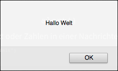
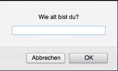

# Web-Technologie

## Animation & Interaktion


## Über mich

Lukas Diener

lukas@zeilenwerk.ch

Informatiker + Lehrer


## Ziele

* Einführung in die Programmierung
* Website-Animation und -Interaktion mit Javascript
* Parallel zu HTML/CSS


## Beispiele

* [Mindmap](http://experts.ekonsil.ch/?id=B26.8&search=Mumps&lang=de&mode=sd&dm=1)
* [Einfache Spiele](http://raptjs.com/play/#/rapt/Intro_1/)
* [Menus](http://www.smartmenus.org/)


## Organisatorisches


## Semesterplan

* 3 Noten
* 2 Tests, 1 Projektabgabe
* Genauer Plan folgt noch, erster Test wahrscheinlich in 3 Wochen


## Folien

[http://bbz.lukasdiener.ch](http://bbz.lukasdiener.ch)


## Was ist Javascript

* Programmiersprache für den Browser
* Mittlerweile schnell
* Gratis
* 3D-Grafik, Animationen, Musik abspielen, ...
* Läuft auf dem PC des Benutzers
* Plattformunabhängig

```javascript
var a = 2
var b = 3
alert(a + b);
```


# Einführung Programmieren


## Was ist Programmieren?

* Liste von Anweisungen an den PC
* PC ist dumm, macht aber genau was man ihm sagt (auch wenn es falsch ist)
* Rechnen, Text anzeigen, Nachrichten hin und her senden


## Sandkasten

Developer Tools im Browser öffnen

* Firefox: Ctrl + Shift + K
* Chrome: Ctrl + Shift + J
* Internet Explorer: F12


## Datentypen

Speichern unterschiedliche Arten von Informationen

Z.B. Kontostand der Bank als Zahl, Benutzername als Text

Andere:

* Datum
* Boolean (Wahr/Falsch)
* Listen
* ...


## Datentyp 1: Zahlen

```js
3
5.4
0.24354634
```

Wichtig: Dezimaltrennzeichen ist der Punkt


Rechnen wie mit normalem Rechner

* Addition: +
* Subtraktion: -
* Multiplikation: *
* Division: /
* Klammern: ( )

Reihenfolge auch wie im Math, zuerst Klammern, dann Punkt, dann Strich


Rechnungen

```js
(1 + 2)

(10 + 2) / 3

5 * 2 + 1
```

Leerzeichen spielen keine Rolle, werden ignoriert


## Datentyp 2: Texte

Immer in Anführungszeichen schreiben

```js
"Hans"

"Paul"

"Magst du Pizza?"
```


Achtung!

```js
Hans
```

gibt `ReferenceError: Hans is not defined`


Rechnungen mit Texten: Addition hängt die Texte zusammen

```js
"Walter" + "Meier"
```

Aber wie gibts eine Lücke?


```js
"Walter " + "Meier"

"Walter" + " Meier"

"Walter" + " " + "Meier"
```


## Zusammenfassung

Zahlen ohne Anführungszeichen

Texte immer mit Anführungszeichen

```js
3 + 4

"Hans"
```

Was passiert mit Zahlen in Anführungszeichen?


Werden als Text behandelt und nicht ausgerechnet!

```js
"1 + 3"

"Hänsel und Gretel"
```


`alert()`

Zeigt Text oder Zahlen in einer Nachrichtenbox an:

```js
alert("Hallo Welt")
```




```js
alert(3 + 4)
```

Warum `7` und nicht `3 + 4`?


Code in der Klammer wird zuerst ausgerechnet, erst dann angezeigt.

```js
alert(3 + 4)
```

wird umgeschrieben zu

```js
alert(7)
```


`prompt()`

Fragt nach einer Benutzereingabe

```js
prompt("Wie alt bist du?")
```




## Datentyp 3: Booleans

Wahr oder Falsch

Meist Resultat aus einem Vergleich, selten sonst gebraucht

```js
3 < 4.1

3 > 5
```


## Vergleichsoperatoren

Vergleiche zwischen zwei Zahlen mit 4 wichtigen Vergleichen:

* Gleichheit: `==`
* Ungleichheit: `!=`
* Grösser: `>`
* Kleiner: `<`

```js
1 == 1

1 != 2

3 > 4

7 < 6
```

Wichtig: Gleichheit mit Doppel-Gleich!


Vergleich von Texten

```js
"Paul" == "Walter"

"Paul" < "Walter"
```


Nach dem Alphabet, Grossbuchstaben vor Kleinbuchstaben

ABCDEFGHIJKLMNOPQRSTUVWXYZabcdefghijklmnopqrstuvwxyz

```js
"Bertha" < "alex"
```

wahr oder falsch?


```js
"Bertha" < "alex"
```

B ist vor a &rarr; "Bertha" ist kleiner als "alex" &rarr; wahr


## Variablen

Werte können gespeichert und später wieder verwendet werden:

```js
var resultat = 7 * 7

var alter = 34

var name = "Hans Peter"
```

Sagt dem PC, dass er eine neue Variable mit Namen `resultat` bzw. `alter` erstellen, und die Werte darin speichern soll.


Wiederverwendung über Variablenname

```js
var resultat = 7 * 7

alert(resultat);
```

Variablenname wird intern mit dem Wert der Variable ersetzt.


Gültige Namen

Nur Buchstaben und Zahlen, erstes Zeichen muss ein Buchstabe sein. Keine Leerzeichen. Einzige Sonderzeichen: `$` und `_`


Achtung!

```js
Hans
```

gibt `ReferenceError: Hans is not defined`

(weil Hans keine definierte Variable ist)


## Zuweisungsoperator

Variablenzuweisungen mit dem Zuweisungsoperator `=`

Rechte Seite wird ausgerechnet und der linken Seite zugewiesen

OK

```js
var a = 3 + 4
```

Falsch

```js
3 + 4 = 2 + 5
```


## Beispiele

```js
var name = prompt("Wie ist dein Name?")
alert(name);
```

```js
var alter = prompt("Was ist dein Alter?")
alert("Du bist " + alter + " Jahre alt.")
```
