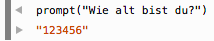

# Web-Technologie

## Animation & Interaktion


## Wiederholung

Verschiedene Datentypen

* Zahlen
* Texte

Werte speichern mit Variablen


## Zahlen

Rechnen wie gehabt

```js
3 * (12 - 6)
2 + 6 + 3
```


## Texte

```js
"Hans Müller"
'Reto Meier'
```

immer mit Anführungszeichen

`"Reto" + "Holz"` gibt `"RetoHolz"`


## Vergleiche

```js
3 < 5
3 < (7 - 3)
"alfa" == "beta"
```


## Ein- und Ausgabe

```js
alert('Mein Text')
prompt('Wie alt bist du?')
```

`alert` zeigt den Text in einem Benachrichtigungsfenster an

`prompt` zeigt den Text in einem Benachrichtigungsfenster an und lässt den Benutzer eine Antwort eingeben


## Variablen

Werte speichern, um sie später zu verwenden.

Schlüsselwort `var` leitet die Variablendeklaration ein.

```js
var a = 4
var b = 7
var c = a + b
var name = prompt("Wie heisst du?")
```


## Probleme

prompt gibt als Resultat immer einen Text!



und damit kann man nicht rechnen...


## Lösung

### Datentypen umwandeln

Text zu Zahl

```js
var alter_als_text = prompt("Wie alt bist du?")
var alter_als_zahl = Number(alter_als_text)
```

`Number(text)` wandelt alles, was zwischen den Klammern ist, in eine Zahl um (oder versucht es zumindest)


Zahl zu Text

```js
var num = 3
var dauer = String(num) + " Wochen"
```

`String(zahl)` wandelt alles zwischen den Klammern in einen Text um.

Weniger wichtig als `Number()`, weil Zahlen meist schon automatisch umgewandelt werden.


## Programmfluss


## Konditionale Ausführung
### oder
## Bedingungen


Codeteil nur unter bestimmten Bedingungen ausführen

```js
var alter = prompt("Wie alt bist du?")
if(Number(alter) < 18) {
  alert("Du bist minderjährig")
}
```

Nur wenn das Alter kleiner als 18 ist, zeigt das Programm "minderjährig" an


## Bedingungen

Schlüsselwort `if` leitet den Bedingungsblock ein

```js
if(bedingung) {
  code1
}
```


Was, wenn die Bedingung nicht wahr ist?

Schlüsselwort: `else`

```js
if(bedingung) {
  code1
} else {
  code2
}
```

der `else`-Block wird ausgeführt, wenn die Bedingung nicht wahr ist


## Bedingungen kombinieren

```js
if(zeit > 10 && zeit < 12) {
  alert('Bald ist Mittag')
}
```

`&&` (UND) verknüpft Bedingungen, so dass alle wahr sein müssen


## Bedingungen kombinieren

```js
if(tag == 'montag' || tag == 'donnerstag') {
  alert('Heute ist Müllabfuhr')
}
```

`||` (ODER) verknüpft Bedingungen, so dass mindestens eine wahr sein muss
