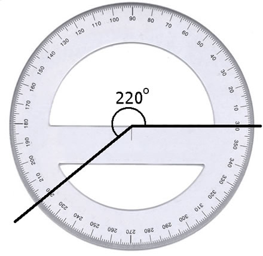

# Web-Technologie

## Animation & Interaktion


## Game-Intro


## Idee

* 2-3 sehr kurze Inputs zu kleinen Bausteinen, danach viel Ausprobieren
* Jede und jeder ein eigenes kleines Spiel (etwa Pong, Snake, Flappy Bird)


## Game-Loop

* Bisher: Eine zeitlich abgeschlossene Aktion, fertig wenn Aufgabe erledigt
* Neu: andauernde Interaktion

* Games und Animationen werden 60x pro Sekunde gezeichnet
* Schleife wird unendlich wiederholt


```js
function repeat() {
    // rechnen

    requestAnimationFrame(repeat);
}

requestAnimationFrame(repeat);
```

`requestAnimationFrame` sagt dem PC, dass er die Funktion `repeat` bei der nächsten guten Gelegenheit ausführen soll.

Alles, was in der Funktion `repeat` steht, wird wiederholt.

[JSFiddle1](http://jsfiddle.net/waL6pmx6/) - [JSFiddle2](http://jsfiddle.net/waL6pmx6/1/) (Achtung, flackert!)


## Bewegung

* Pro Schritt 1 Pixel bewegen -> 60px / s


## Einrichten

* Neue HTML-Datei mit verlinktem CSS
* 2 JS-Dateien eingebunden:
  * `http://lukasdiener.ch/bbz/game.js`
  * `http://lukasdiener.ch/bbz/jquery.js`


### Game-Container

* Div-Element mit ID, z.B. 'game'
* Per CSS Rand sichtbar machen und Grösse setzen

[JSFiddle](http://jsfiddle.net/ahbda34q/)


### Game-Objekte

* Alle Objekte sind HTML-Elemente oder Bilder
* Hilfsfunktionen in `game.js`

```js
var player = createEntity($('<div class="player"></div>'));
$('#game').append(player.element);
```

Achtung: mit CSS stylen, damit sichtbar!

[JSFiddle](http://jsfiddle.net/ch6g95jw/)


## Game-Objekte

Verschiedene Eigenschaften (Geschwindigkeit, Richtung, usw):

`player.geschwindigkeit = 3;`

Setzt die Bewegungsgeschwindigkeit, zu Beginn 1


`player.richtung = 90`



Richtung in Grad auf dem Einheitskreis (0 = nach rechts, 90 = nach oben, usw)


`player.positionX()` und `player.positionY()`

Gibt die aktuelle x- und y-Position des Objekts an


`player.move()`

Bewegt das Objekt basierend auf Geschwindigkeit und Winkel eine Einheit weiter


`player.setPosition(x, y)`

Setzt das Objekt auf die Position (x,y)


## Aufgabe

Ausgangslage:

[JSFiddle](http://jsfiddle.net/ts8gLsuy/)

Wie kann verhindern, dass der rote Würfel aus dem Spiel fährt?


## Zusammenfassung

`player.geschwindigkeit = 3;`: Geschwindigkeit

`player.richtung = 90`: Richtung auf Einheitskreis

`player.positionX()` und `player.positionY()`: Positionskoordinaten

`player.move()`: basierend auf Geschw. und Richtung bewegen

`player.setPosition(x, y)`: Position manuell setzen


## Benutzereingaben

* Wie kann man über Tastatureingaben das Spiel kontrollieren?

Ausserhalb des Loops:

```js
$(document).keyup(function(e) {
  if(e.key == 'w') {
    player.geschwindigkeit = player.geschwindigkeit + 1;
  }
  if(e.key == 's') {
    player.geschwindigkeit = player.geschwindigkeit - 1;
  }
});
```

[JSFiddle](http://jsfiddle.net/Lsy3d0ks/)


## Aufgabe

* Idee für eigenes kleines Spiel in der Form von Snake, Pong, [Fastfives](http://fastfives.mailchimp.com/) oder eigene Idee umsetzen
* Jede Woche ein paar neue Inputs und Erweiterung der `game.js`
* Nächste Themen: Bilder, Sounds, Menus, Physik
