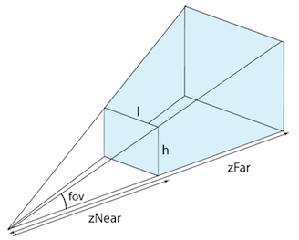
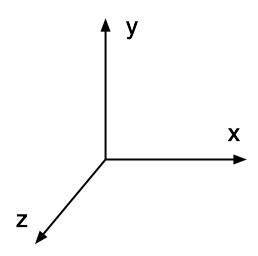

# Web-Technologie

## Animation & Interaktion


## Intro 3D


## Eigene Projekte

* 3D-Spiel, Animation, Cardboard-Website, oder was auch immer
* Bis Ende Semester, wird 2x benotet
* Zweiergruppen
* Jeweils 2-4 Inputs pro Woche


## Beispiel

[Demo](samples/10_intro.html)


## Aufbau

* Three.js
* Szene
* Renderer
* Kamera
* Objekte
* Render-Loop


## Three.js

* Hilfscode für 3D-Animationen, Spiele usw.
* Nimmt uns sehr sehr viel Arbeit ab (2000 Zeilen Code --> 100 Zeilen)


## Szene

* Alle Objekte (Kamera, Lichter und so weiter) werden dort platziert


Szene definieren

`var scene = new THREE.Scene();`


## Renderer

* Bestimmt, mit welcher Technik die Objekte angezeigt werden und wie gross
* WebGL: Schnell, relativ neu
* Canvas: Langsamer, besser unterstützt
* SVG: Langsam, sehr gut unterstützt


Renderer im Vollbildmodus definieren, Kanten glätten

```js
renderer = new THREE.WebGLRenderer({ antialias: true });
renderer.setSize(WIDTH, HEIGHT);
```


## Kamera

* Verschiedene Projektionsarten
* Perspektivisch: Wie mit normaler Kamera [Demo](http://threejs.org/examples/#webgl_interactive_cubes)
* Orthogonal: ohne Perpektive, wie Pokemonspiele [Demo](http://threejs.org/examples/#canvas_camera_orthographic)


Kamera definieren, Position setzen, Richtung setzen

```js
camera = new THREE.PerspectiveCamera(70, WIDTH / HEIGHT, 1, 10);
camera.position.set(0, 3.5, 5);
camera.lookAt(scene.position);
```


```js
camera = new THREE.PerspectiveCamera(70, WIDTH / HEIGHT, 1, 10);
```

```js
camera = new THREE.PerspectiveCamera(fov, verhältnis, near, far);
```




```js
camera.position.set(0, 3.5, 5);
```

```js
camera.position.set(x, y, z);
```




## Objekte / Meshes

* Eigentliche Objekte
* Verschiedene Formen, Farben, Glanz usw


```js
cube = new THREE.Mesh(new THREE.CubeGeometry(2, 2, 2), new THREE.MeshNormalMaterial());
```

```js
cube = new THREE.Mesh(form, material);
```


## Render-Loop

* Bewegung besteht aus vielen Einzelbildern (60 pro Sekunde)
* In jedem Schritt wird die Position ein bisschen verändert


* Alle 16ms = 60x/Sekunde neu zeichnen
* Jeweils um 0.01 (in [Radiant](https://de.wikipedia.org/wiki/Radiant_%28Einheit%29)) rotieren
* (360° = 2 pi, 180° = pi usw)

```js
window.setInterval(function() {
  cube.rotation.y += 0.01;
  renderer.render(scene, camera);
}, 16);
```


* Vorbereitung (Objekte erstellen, Szene einrichten) vor dem Loop
* Logik für während Animation im Loop


```js
cube.rotation.y += 0.01;
```

ist die Kurzform von

```js
cube.rotation.y = cube.rotation.y + 0.01;
```


## Probleme?

Googeln nach "Three js Suchbegriff"


## Positionierung

Zwei Möglichkeiten:

* Absolute Bewegung (im Verhältnis zur Szene)
* Relative Bewegung (im Verhältnis zum Objekt)


### Absolute Bewegung

```js
cube.position.x += 0.005;
```

bewegt den Würfel in jedem Schritt um 0.005 in der x-Richtung (nach rechts)


## Relative Bewegung

```js
cube.translateX(0.005);
```

bewegt den Würfel um 0.005 Einheiten nach vorne in seiner Blickrichtung. Entsprechend funktionieren `translateY` und `translateZ`.


## Rotation

Gleiche Achsen wie bei der Positionierung

```js
cube.rotation.x += 0.01
```

Rotiert den Würfel um die X-Achse (horizontale links-rechts-Achse)


## Skalierung

Gleiche Achsen wie bei Positionierung

```js
cube.scale.x += 0.01;
```

verbreitert den Würfel um jeweils 0.01 Einheiten
