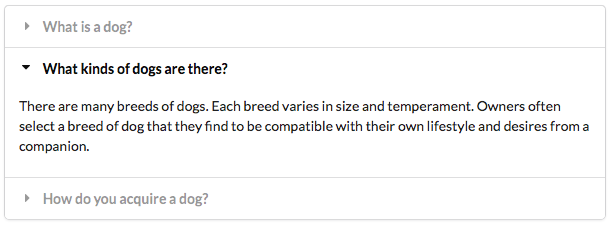
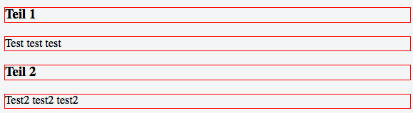

# Web-Technologie


## Tastatureingaben

```js
document.addEventListener('keyup', tastatur);

function tastatur(event) {
  var code = event.keyCode;
  if(code == 87) {
    ...
  }
  if(code == 83) {
    ...
  }
}
```

### Key Codes

Jede Taste hat einen Code, kann [hier](http://www.cambiaresearch.com/articles/15/javascript-char-codes-key-codes) abgerufen werden.


## Notifications

Im Browser können Benachrichtigungen angezeigt werden, die nach 5 Sekunden wieder verschwinden

* Schritt 1: Erlaubnis einholen
* Schritt 2: Nachricht anzeigen


```js
Notification.requestPermission(function (permission) {
  if (permission === "granted") {
    var notification = new Notification("Hallo!", { body: 'Mein Text' });
  }
});
```

[Demo](https://jsfiddle.net/p2ymth8g/)


## Akkordeon

Idee: kompaktes Menu, Informationen werden beim draufklicken angezeigt




Vorgehen:

* Überschriften und Inhalte abwechseln
* Per CSS alle Inhalte verstecken
* Bei Klick: entsprechenden Inhalt anzeigen


```js
<div id="akkordeon">
  <h3>Teil 1</h3><p>Test test test</p>
  <h3>Teil 2</h3><p>Test2 test2 test2</p>
</div>
```




Alle Elemente auswählen und speichern

```js
var titles = document.querySelectorAll('h3');
var contents = document.querySelectorAll('p');
```


Klicks auf Titel abfangen

```js
for(var i = 0; i < titles.length; i = i + 1) {
	titles[i].addEventListener('click', aufklappen);
}
```


Entsprechende Inhalte anzeigen

```js
function aufklappen() {
  for(var i = 0; i < contents.length; i = i + 1) {
    contents[i].style.display = 'none';
  }
  var inhalt = this.nextSibling;
  inhalt.style.display = 'block';
}
```

[Demo](https://jsfiddle.net/hh0fuy5j/)
