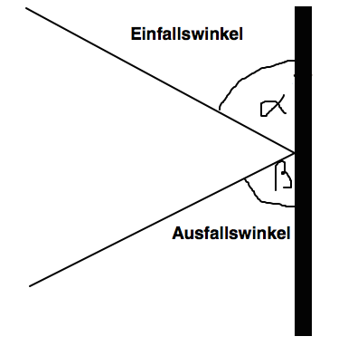

# Web-Technologie

## Animation & Interaktion


## Programm

* Zufall
* Abprallen
* Gravitation & Hüpfen


## Zufall

Viele Spiele haben eine Zufallskomponente eingebaut (zufällige Zeitdauer, zufälliges Terrain, zufällige Positionen). Spiele werden dadurch abwechslungsreicher.

Wird alles über Zufallszahlen gemacht:

```js
var a = Math.random();
```

gibt eine Zufallszahl zwischen 0 und 0.9999999999 (z.B. 0.16296216123441964)


### Beispiele

Zufallszahl zwischen 0 und 300 für zufällige Startposition:

```js
var a = Math.random() * 300;
var b = Math.random() * 300;
player.setPosition(a, b);
```

[JSFiddle](http://jsfiddle.net/zzoxakrf/)


### Beispiele

Zufällige Verzögerung (0 bis 1000 ms):

```js
window.setTimeout(function() {
  // Handlung
}, Math.random() * 1000);
```


### Beispiele

Zufälliges Zeitintervall (1000 bis 3000 ms):

```js
window.setInterval(function() {
  // Handlung
}, 1000 + Math.random() * 2000);
```


## Abprallen


Regel: Einfallswinkel = Ausfallswinkel




Einfallen: Richtung = **330°** --> &alpha; = 330° - 270° = 60°

Ausfallen: &beta; = 60° --> Richtung = 270° - 60° = **210°**

[JSFiddle](http://jsfiddle.net/4yqjx5cv/1/)
[JSFiddle2](http://jsfiddle.net/tjLs8q3d/)


## Gravitation

Wie kann ich ein Spiel à la Flappy Bird machen?

* Gravitation
* Springen
* Automatisch bewegen


### Gravitation

Einschalten mit

```js
game.gravity = 1;
```

Der Gravitationswert kann eine beliebige positive Zahl sein. Je grösser die Zahl, desto stärker die Schwerkraft.

[JSFiddle](http://jsfiddle.net/ksq8qb0f/)


### Springen

Befehl zum Springen (Gravitation muss aktiviert sein!)

```js
player.jump(1);
```

Lässt den Spieler aufspringen. Je grösser die Zahl, desto stärker der Sprung.


## Automatisch bewegen

Idee:

* Spieler bleibt an Ort
* Gelände bewegt sich ihm entgegen

```js
window.setInterval(function() {
    var ground = createEntity($('<div class="ground"></div>'));
    game.add(ground);
    ground.setPosition(300, Math.random() * 300);
    ground.geschwindigkeit = 1;
    ground.richtung = 180;
    ground.weightless = true;
    window.setTimeout(function() {
      game.remove(ground);
    }, 3000);
}, 2000);
```

[JSFiddle](http://jsfiddle.net/jvmk3ccs/)


Alle 2000 Millisekunden einen neuen Block generieren:

```js
window.setInterval(function() {

}, 2000);
```


Block einstellen wie gehabt:

```js
var ground = createEntity($('<div class="ground"></div>'));
game.add(ground);
ground.setPosition(300, Math.random() * 300);
ground.geschwindigkeit = 1;
ground.richtung = 180;
```


Wichtig! Die Blöcke sollen nicht runterfallen:

```js
ground.weightless = true;
```


Blöcke nach 3 Sekunden wieder löschen:

```js
window.setTimeout(function() {
  game.remove(ground);
}, 3000);
```


Alle Objekte des Spiels bewegen:

```js
player.move();
player2.move();
ball.move();
```

ersetzen durch

```js
game.move();
```
