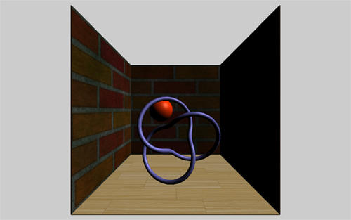
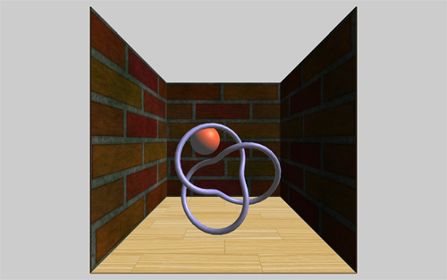
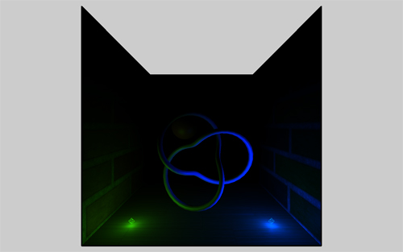
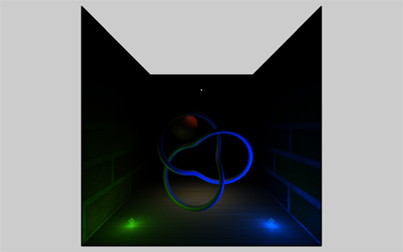
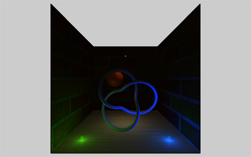

# Web-Technologie

## Animation & Interaktion


## Programm

* Tastatur
* Flächen
* Lichter


## Korrektur

* Translation und Rotation funktionieren beide sowohl aus Sicht der Szene als auch aus Sicht des Objekts:


Absolut bzw. aus Sicht der Szene:

* `cube.position.x = 3`
* `cube.position.x = cube.position.x + 1`
* `cube.rotation.x = 2 * Math.PI`


Relativ bzw. aus Sicht des Objekts:

* `cube.translateX(3)`
* `cube.rotateX(2 * Math.PI)`


## Tastatureingaben

Tastatureingaben passieren nicht im Game-Loop sondern parallel dazu. Deshalb: Eventhandler *vor* dem Loop definieren und *im* Game-Loop auswerten.


## Key Codes

Jede Taste hat einen Code, kann [hier](http://www.cambiaresearch.com/articles/15/javascript-char-codes-key-codes) abgerufen werden.


Vor dem Game-Loop:

```js

var keys = [];

document.addEventListener('keydown', tastaturDown);
document.addEventListener('keyup', tastaturUp);

function tastaturDown(event) {
  keys[event.keyCode] = true;
}

function tastaturUp(event) {
  keys[event.keyCode] = false;
}
```

Setzt beim Runterdrücken eine Variable auf `true`, beim Loslassen wieder auf `false`


Im Game-Loop:

```js
window.setInterval(function() {

  if(keys[40]) {
    cube.translateZ(-0.01);
  }
  if(keys[38]) {
    cube.translateZ(0.01);
  }

  renderer.render(...);
});
```

Testet, ob die jeweiligen Tasten gedrückt sind (bzw. ob Variable auf `true` gesetzt wurde)


## Flächen

Objekte werden immer als eine Art `Geometry` definiert (z.B. `CubeGeometry`, `SphereGeometry`). So auch Flächen:

```js
 var geometry = new THREE.PlaneGeometry(60, 60, 9, 9);
 var material = new THREE.MeshNormalMaterial();
 var plane = new THREE.Mesh(geometry, material);
 scene.add(plane);
```


```js
THREE.PlaneGeometry(breite, höhe, segmente_breit, segmente_hoch)
```

* Breite
* Höhe
* Anzahl Segmente in Breite
* Anzahl Segmente in Höhe

-> Segmente spielen nur eine Rolle, wenn die Fläche nicht komplett flach sein soll (z.B. Hügelterrain)

[Beispiel](http://threejs.org/docs/#Reference/Extras.Geometries/PlaneGeometry)


## Lichter

* 5 Arten von Licht, alle unterschiedliche Eigenschaften
* Braucht oft mehrere für Realismus
* Nur effektiv für Lambert- und Phong-Material
* **Achtung**: noch keine Schatten ([komplizierter](http://learningthreejs.com/blog/2012/01/20/casting-shadows/))


## Directional Light

* Simuliert Sonne
* Unendlich weit weg, Position spielt keine Richtung, nur Winkel

```js
var directionalLight = new THREE.DirectionalLight( 0xffffff, 0.5 );
directionalLight.position.set(100, 100, 50);
scene.add( directionalLight );
```

`THREE.DirectionalLight( farbe, intensität );`

[Beispiel](http://threejs.org/docs/#Reference/Lights/DirectionalLight)





## Ambient Light

* Umgebungslicht
* Beleuchtet *alles* von jeder Seite gleich
* Erst am Schluss verwenden. Zuerst Szene ausleuchten, wenn noch irgendwo schwarz, minimale Intensität Ambient bis ganze Szene sichtbar.

```js
var light = new THREE.AmbientLight( 0x404040 );
scene.add( light );
```





## Point Light

* Simuliert Glühbirne
* Scheint in alle Richtungen

```js
var light = new THREE.PointLight( 0x0033ff, 3, 150, 1 );
light.position.set( 70, 5, 70 );
scene.add( light );
```

`THREE.PointLight( farbe, intensität, distanz, abnahme );`

* Distanz: Leuchtdistanz, Stärke nimmt linear ab
* Abnahme: Abnahme der Leuchtstärke

[Beispiel](http://threejs.org/examples/#webgl_lights_pointlights2)





## Spot Light

* Spot in bestimmte Richtung

```js
var spotLight = new THREE.SpotLight( 0xffffff, 1, 200, 20, 10 );
spotLight.position.set( 0, 150, 0 );

var spotTarget = new THREE.Object3D();
spotTarget.position.set(0, 0, 0);
spotLight.target = spotTarget;

scene.add(spotLight);
```

`THREE.SpotLight( farbe, intensität, distanz, winkel, streuung );`

* Winkel: Winkel des Spots
* Streuung: seitliche Abnahme der Lichtstärke





## Hemisphere Light

* Wie Ambientlight, aber Übergang statt gleichfarbig

```js
var light = new THREE.HemisphereLight( 0xffe5bb, 0xFFBF00, 0.1 );
scene.add( light );
```

`THREE.HemisphereLight( farbe1, farbe2, intensität );`

* Übergang zwischen Farbe1 (Himmel) und Farbe2 (Boden)

[Beispiel](http://threejs.org/examples/#webgl_lights_hemisphere) (Directional von oben, Hemisphere für Umgebung)

"H" drücken schaltet Hemisphere aus.





## Zusammenfassung

[Referenz](http://threejs.org/docs/#Reference/Lights/AmbientLight)

* **Directional Light** (Sonne, unendlich weit weg, nur Winkel relevant, da Strahlen parallel)
* **Ambient Light** (Umgebungslicht, sieht doof aus. Erst ganz am Schluss hinzufügen, wenn Orte, wo noch kein Licht. Sparsam.)
* **Point Light** (Glühbirne, in alle Richtungen)
* **Spot Light** (Licht in bestimmte Richtung)
* **Hemisphere Light** (Umgebungslicht wie Ambient, aber mit Übergang statt einfacher Farbe. Schöner als Ambient)
