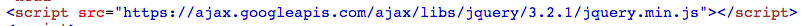

# Web-Technologie

## Animation & Interaktion


## jQuery

jQuery ist ein Stück Code, das in eine Seite eingebunden werden kann. Damit ist die Programmierung von Animationen deutlich einfacher als mit normalem Javascript.


### Einbinden

Der folgende Tag muss im `<head>` der Website eingebunden sein:



(https://ajax.googleapis.com/ajax/libs/jquery/3.2.1/jquery.min.js)

Der Rest des Codes steht immer noch in einem Skript-Tag am Ende der Seite.


### Auswahl von Elementen

Statt `querySelector()` und `querySelectorAll()` gibt es neu nur noch einen Befehl, um Elemente auszuwählen: `$`.

Dieser wählt alle auf den Selektor passenden Elemente aus, d.h. wie `querySelectorAll()`.

```js
var bilder = $('img')
var menu = $('.nav')
```


### Verändern von Elementen

Stil-Elemente können mit dem `css()`-Befehl verändert werden. Dabei werden alle passenden Elemente verändert (ohne for-Schleife!):

```js
var bilder = $('img')
bilder.css({"margin-top": "20px"})
```


### Animationen

Ähnlich funktionieren Animationen. Statt dem Befehl `css()` wird nun der Befehl `animate()` verwendet.

```js
var titel = $('h4')
titel.animate({"font-size": "20px"})
```


### Event-Listener

Auch die Behandlung von Ereignissen ist einfacher. Der folgende Code wartet auf einen Klick auf ein beliebiges Bild und gibt diesem einen roten Rahmen:

```js
$("img").click(rot);

function rot() {
  $(this).css({"border": "1px solid red"})
}
```


### Tastatursteuerung

```js
$( "#target" ).keypress(function( event ) {
  if ( event.key == 'd' ) {
    console.log('d gedrückt!')
  }

  if ( event.key == 'a' ) {
    console.log('a gedrückt!')
  }
});
```
